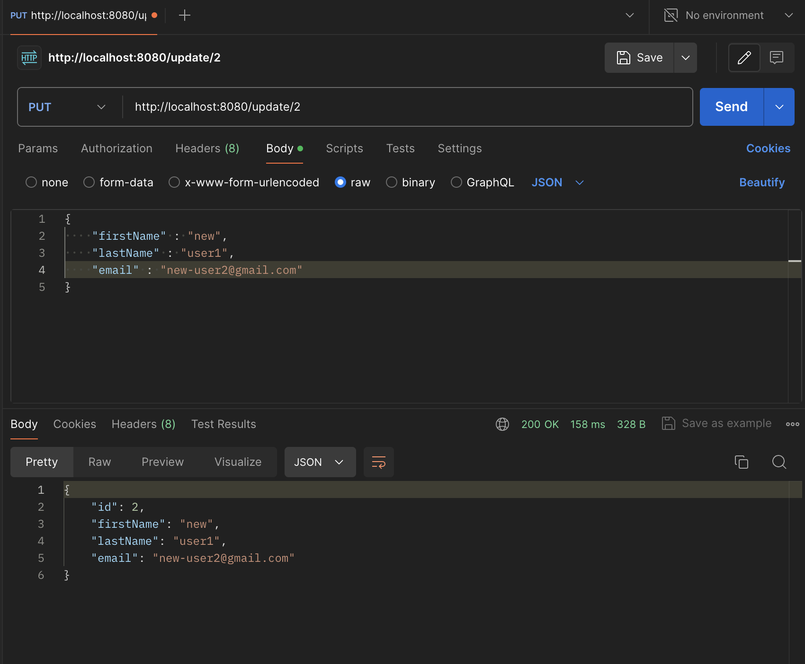

# User Management System
This application is built using Spring Boot and provides a RESTful API for managing user data in a database. It allows to add new users, read user data, update existing users, and delete users.

## Features

### 1. Add User :

**Endpoint :** '/add' 
**Method :** POST 

### 2. Get All Users:

**Endpoint :** '/users' 
**Method :** GET 

### 3. Get user with specific id:

**Endpoint :** '/users/{id}' 
**Method :** GET 

### 4. Update User with specific id:

**Endpoint :** '/update/{id}' 
**Method :** PUT 

### 5. Update specific info for a user :

**Endpoint :** '/add' 
**Method :** PATCH 

### 6. Delete User with specific id:

**Endpoint :** '/{id}' 
**Method :** DELETE 

